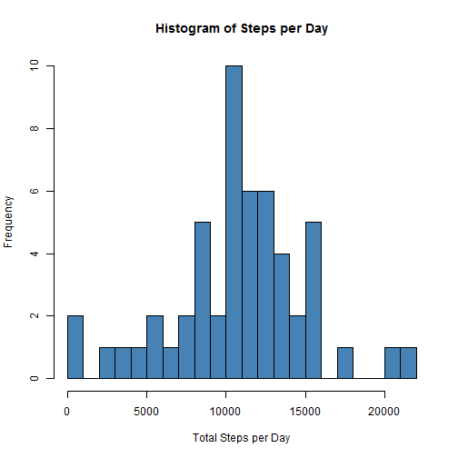
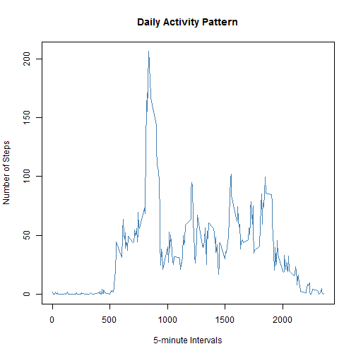
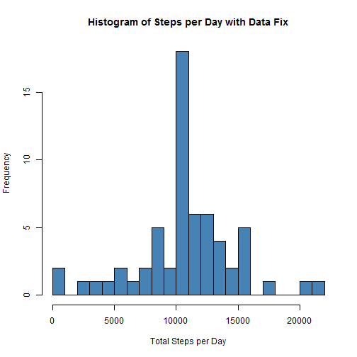
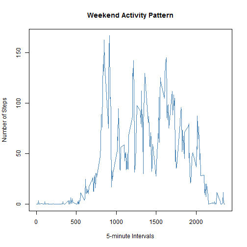
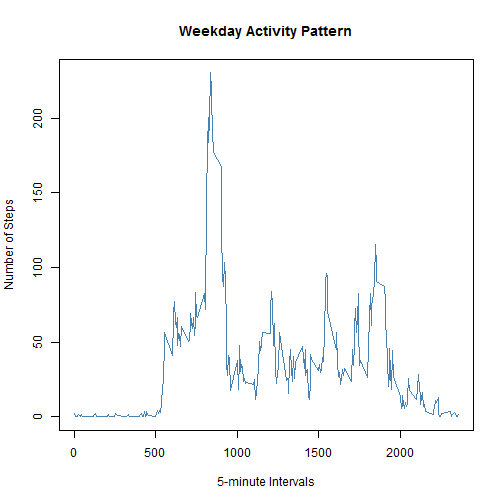

The purpose of this document is to analyze the data collected from a personal activity
monitoring device such as Fitbit, Nike Fuelband, etc. The data came from an anonymous
individual and it collected the number of steps taken in 5-minute intervals between the months of October and November 2012.


### Loading and preprocessing the data

Load the data (i.e. read.csv())

```r
unzip("repdata-data-activity.zip")
actDF <- read.csv(file="activity.csv", header=TRUE)
```

Process/transform the data (if necessary) into a format suitable for your analysis

```r
actDF$date <- as.Date(actDF$date, format="%Y-%m-%d")
```

The dplyr package is also loaded which will be used later in the analysis

```r
require(dplyr)
```


### What is mean total number of steps taken per day?

#### For this part of the assignment, missing values in the dataset are ignored

Calculate the total number of steps taken per day

```r
totalSteps <- aggregate(cbind(steps) ~ date, data=actDF, FUN=sum)
```

Make a histogram of the total number of steps taken each day
 

Calculate and report the mean and median of the total number of steps taken per day.

```r
meanTotalSteps <- mean(totalSteps$steps, na.rm=TRUE)
medianTotalSteps <- median(totalSteps$steps, na.rm=TRUE)
```

The mean of the total steps per day is **1.0766189 &times; 10<sup>4</sup>** and the median of the total steps per day is **10765**.

### What is the average daily activity pattern?

Make a time series plot (i.e. type = "l") of the 5-minute interval (x-axis) and the average number of steps taken, averaged across all days (y-axis)

```r
interval <- aggregate(actDF$steps, by=list(interval=actDF$interval), na.rm=TRUE, FUN=mean)
```
 

Which 5-minute interval, on average across all the days in the dataset, contains the maximum number of steps?

```r
maxInterval <- interval[which.max(interval$x),]
```

```r
maxInterval
```

```
##     interval        x
## 104      835 206.1698
```

Interval **835** is the interval with the most steps at **206.1698113** steps.


### Imputing missing values

#### Note that there are a number of days/intervals where there are missing values (coded as NA). The presence of missing days may introduce bias into some calculations or summaries of the data.

Calculate and report the total number of missing values in the dataset (i.e. the total number of rows with NAs)

```r
totalNAs <- sum(is.na(actDF$steps))
```

```r
totalNAs
```

```
## [1] 2304
```

There are **2304** intervals with missing values (NA).

Devise a strategy for filling in all of the missing values in the dataset. The strategy does not need to be sophisticated. For example, you could use the mean/median for that day, or the mean for that 5-minute interval, etc.

For this project, the mean of each interval will be used to replace the missing values.

```r
meanTotalInterval <- tapply(actDF$steps, actDF$interval, mean, na.rm=TRUE)
```

Create a new dataset that is equal to the original dataset but with the missing data filled in.

```r
noNADF <- actDF
allNAs <- is.na(noNADF$steps)
noNADF$steps[allNAs] <- meanTotalInterval[as.character(noNADF$interval[allNAs])]
```

Make a histogram of the total number of steps taken each day and Calculate and report the mean and median total number of steps taken per day.

```r
totalStepsNoNA <- aggregate(cbind(steps) ~ date, data=noNADF, FUN=sum)
```
 

Do these values differ from the estimates from the first part of the assignment? What is the impact of imputing missing data on the estimates of the total daily number of steps?

```r
meanTotalStepsNoNA <- mean(totalStepsNoNA$steps, na.rm=TRUE)
medianTotalStepsNoNA <- median(totalStepsNoNA$steps, na.rm=TRUE)
meanDiff <- meanTotalStepsNoNA - meanTotalSteps
medianDiff <- medianTotalStepsNoNA - medianTotalSteps
```

```r
meanDiff
```

```
## [1] 0
```

```r
medianDiff
```

```
## [1] 1.188679
```

The difference between the mean of the dataset with missing values and the dataset that was "data fixed" is **0**.

The difference between the mean of the dataset with missing values and the dataset that was "data fixed" is **1.1886792**.

### Are there differences in activity patterns between weekdays and weekends?

#### For this part the weekdays() function may be of some help here. Use the dataset with the filled-in missing values for this part.

Create a new factor variable in the dataset with two levels - "weekday" and "weekend" indicating whether a given date is a weekday or weekend day.

```r
noNADF <- mutate(noNADF, week=weekdays(date))
noNADF <- noNADF %>% mutate(typeOfWeek = ifelse(week=="Saturday" | week=="Sunday","weekend", "weekday"))
```

Make a panel plot containing a time series plot (i.e. type = "l") of the 5-minute interval (x-axis) and the average number of steps taken, averaged across all weekday days or weekend days (y-axis). See the README file in the GitHub repository to see an example of what this plot should look like using simulated data.

```r
noNADFWeekend <- subset(noNADF, typeOfWeek == "weekend")
noNADFWeekday <- subset(noNADF, typeOfWeek == "weekday")
intervalWeekend <- aggregate(noNADFWeekend$steps, by=list(interval=noNADFWeekend$interval), na.rm=TRUE, FUN=mean)
intervalWeekday <- aggregate(noNADFWeekday$steps, by=list(interval=noNADFWeekday$interval), na.rm=TRUE, FUN=mean)
```
  


